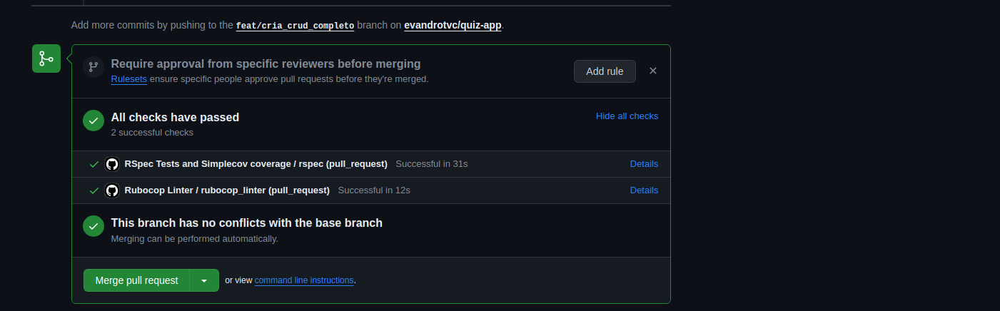

# quiz-app


## Instalando projeto

É necessário ter Docker e docker-compose. A aplicação roda o banco e o server tudo em docker.

Para instalar o projeto, siga estas etapas:

Setando o .env
```
copie o arquivo .env.test com o nome .env
```

```
docker compose build
```

depois rode
```
docker compose up
```

Se tudo foi instalado com sucesso, estará rodando os containers postgres(port: 5432) e o server(port: 3000)

Comando para entrar no container e caso queira rodar os testes
```
docker exec -it app bash
```

Agora é possível entrar no http://localhost:3000/ e realizar os testes se todos os containers executaram corretamente


## Tests (Rspec)

No terminal, caso queira rodar os testes, basta entrar no container do app e executar comando a seguir.
```
RAILS_ENV=test rspec
```

### Testes passando



## Uso da plataforma
https://github.com/evandrotvc/quiz-app/assets/51249134/05468f75-8447-4273-afd6-d5e2a3d701eb


