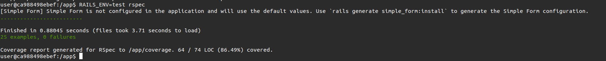

# municipies-app


## Instalando projeto

É necessário ter Docker e docker-compose. A aplicação roda o banco e o server tudo em docker.
Coloque no .env dados válidos de uma conta Twilio, não irei colocar meus dados, porque como o repo é público, a twilio
sempre recria o token. Então para rodar os testes e usar a aplicação da maneira correta, sete corretamente esses dados da twilio.
Pois o sms está dentro de callback que irá mandar o sms para pessoa que entrou na aplicação
Para instalar o projeto, siga estas etapas:

Setando o .env
```
copie o arquivo .env.test com o nome .env
```
depois rode o comando para liberar espaço para o elastic search
```
sudo sysctl -w vm.max_map_count=262144
```
```
docker compose build
```

depois rode
```
docker compose up
```

Se tudo foi instalado com sucesso, estará rodando os containers postgres(port: 5432) e o server(port: 3000), redis(port: 6379) e elasticSearch(port: 9200)

Agora, precisa entrar no container e rodar o sidekiq ( ele que irá mandar o email pra o mailcatcher e também reindexar os index no elastic search)
```
docker exec -it app bash
```
e Rode:
```
bundle exec sidekiq
```
Agora é possível entrar no http://localhost:3000/ e realizar os testes se todos os containers executaram corretamente

### Executando o front Vuejs

É necessário ir na pasta /frontend e executar, os seguintes comandos fora do container. Utilizei a versão do Node 18.13.0

```
yarn
yarn dev
```

## Tests (Rspec)

No terminal, caso queira rodar os testes, basta entrar no container do app e executar comando a seguir.
```
RAILS_ENV=test rspec
```

### Testes passando



## Uso da plataforma
<video width="630" height="300" src="https://github.com/evandrotvc/municipies/assets/51249134/3976f740-43fd-4992-80de-25ae82c5ee43"></video>


### Tooltips de erros de validações


## Examples
### Mailer


### SMS (exemplo)


